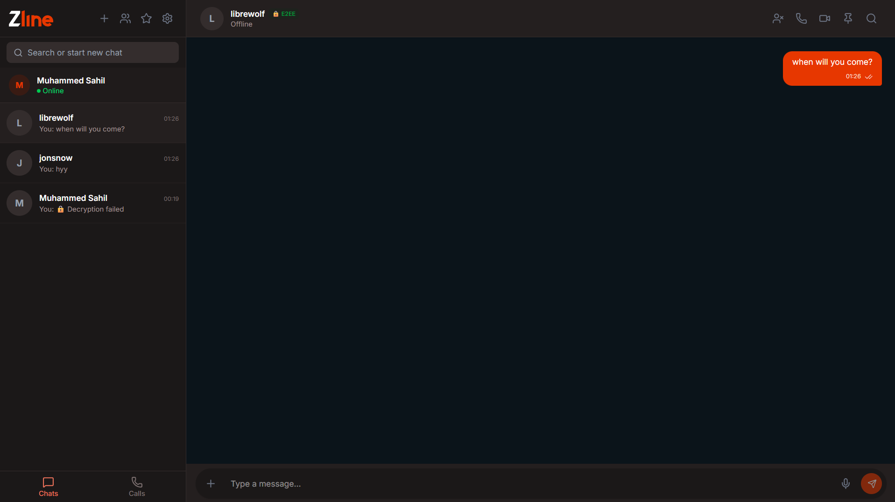
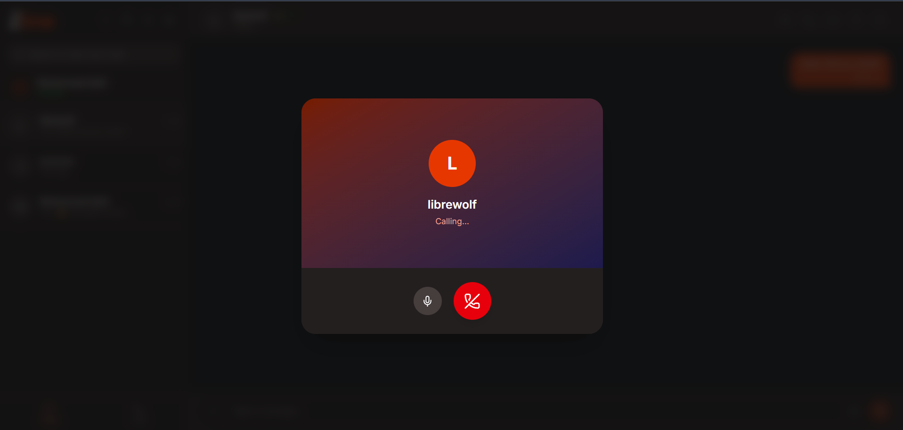

<div align="center">

# 💬 Zline

### **Private by Design. Secure by Default.**

*A modern real-time messaging platform built with Next.js, WebRTC, Socket.IO and MongoDB.*

<br>

[](https://zline.vercel.app)
[]()
[]()
[]()

<br>


<br>


</div>

---

# ✨ Overview

Zline is a production-ready end-to-end encrypted messaging platform focused on privacy, security and real-time communication.

Built to explore modern distributed application development, Zline combines secure authentication, encrypted messaging, WebRTC calling, scalable socket communication and production deployment into one complete application.

Rather than cloning an existing messenger, the goal was to understand how real communication platforms are engineered.

---

# 📸 Preview

<p align="center">





</p>

---

# 🎥 Demo

<p align="center">


</p>

---

# 🚀 Features

| Authentication | Communication | Security |
|---------------|--------------|----------|
| ✅ Email Login | ✅ Real-time Chat | ✅ End-to-End Encryption |
| ✅ Google OAuth | ✅ Voice Calls | ✅ JWT Authentication |
| ✅ Session Management | ✅ Video Calls | ✅ HMAC Socket Auth |
| ✅ Protected Routes | ✅ Group Calls | ✅ NoSQL Protection |
| ✅ Account Recovery | ✅ Voice Messages | ✅ IDOR Protection |
| ✅ Delete Account | ✅ Search Messages | ✅ Rate Limiting |
| | ✅ Pin Messages | ✅ Secure Headers |
| | ✅ Star Messages | ✅ CORS Protection |
| | ✅ Push Notifications | ✅ Authorization Checks |

---

# 🏗 Architecture

<p align="center">


</p>

```
Browser
     │
     ▼
 Next.js Application
     │
 ┌───────────────┐
 │               │
Auth.js      Socket.IO
 │               │
 │           WebRTC
 └──────┬────────┘
        ▼
 MongoDB Atlas
        │
        ▼
 Render Socket Server
```

---

# 💻 Tech Stack

## Frontend


---

## Backend


---

## Deployment


---

# 🛡 Security

> Security was treated as infrastructure, not as a feature.

- 🔐 End-to-End Encryption
- 🔐 JWT Authentication
- 🔐 Google OAuth
- 🔐 HMAC Socket Authentication
- 🛡 Authorization Validation
- 🛡 NoSQL Injection Protection
- 🛡 IDOR Protection
- 🛡 Rate Limiting
- 🛡 Secure Headers
- 🛡 Input Validation
- 🛡 CORS Protection

---

# 📂 Project Structure

```
app/
components/
hooks/
lib/
models/
public/
socket-server/
types/
utils/
```

---

# ⚙ Environment Variables

```env
MONGODB_URI=

AUTH_SECRET=

AUTH_GOOGLE_ID=

AUTH_GOOGLE_SECRET=

NEXT_PUBLIC_SOCKET_URL=

NEXT_PUBLIC_APP_URL=
```

---

# 🚀 Getting Started

```bash
git clone https://github.com/YOUR_USERNAME/zline.git

cd zline

npm install

npm run dev
```

---

# 📈 Roadmap

## ✅ Version 1.0

- [x] Authentication
- [x] Google OAuth
- [x] Secure Messaging
- [x] Voice & Video Calls
- [x] Group Calls
- [x] Push Notifications
- [x] Production Deployment
- [x] Security Hardening

## 🔮 Future

- [ ] Desktop Client

- [ ] Mobile App

- [ ] Friend System

- [ ] Shared Media

- [ ] Message Scheduling

---

# 🤝 Contributing

Contributions, ideas and improvements are welcome.

Please open an Issue first before submitting major changes.

---

# 📜 License

This project is licensed under the MIT License.

---

# 🙏 Acknowledgements

Special thanks to the open-source community and the maintainers of:

- Next.js
- React
- MongoDB
- Socket.IO
- WebRTC
- Tailwind CSS
- Auth.js
- Vercel
- Render

Without their work, projects like this would be significantly harder to build.

---

<div align="center">

# 💬 Zline v1.0

### *Private by Design. Secure by Default.*

*"Some projects are built to impress.*

*Others are built to teach.*

**Zline was built to do both."*

⭐ If you found this project interesting, consider giving it a star.

---

**Built with curiosity, persistence, and an unreasonable amount of debugging.**

</div>